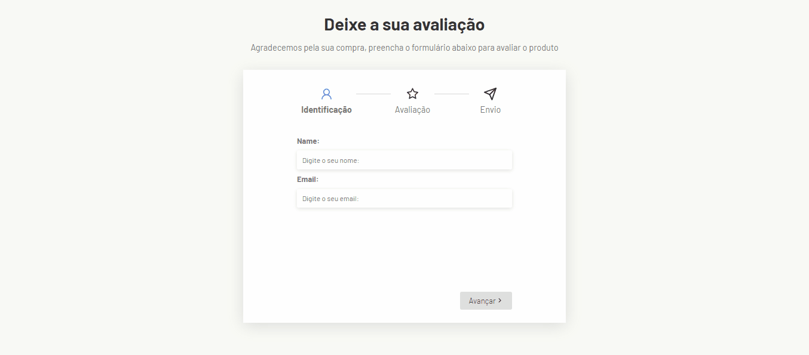

# Multi-Part Form Project

Bem-vindo ao Multi-Part Form Project, um projeto desenvolvido em React + Vite para criar um formulário de várias partes.

## O Que Aprendi

Ao trabalhar neste projeto, pude reforçar muitos dos conceitos que aprendi anteriormente no projeto Get-A-Pet. Aqui estão alguns pontos principais:

1. **React Components**: Reforcei meu entendimento sobre a criação de componentes React e sua reutilização em diferentes partes do aplicativo. Isso me ajudou a manter uma estrutura mais organizada e modular.

2. **State Management**: Aprendi mais sobre a gestão de estado em aplicações React, especialmente ao lidar com um formulário de várias partes. Usei estados locais para cada seção do formulário e um estado global para armazenar os dados consolidados.

3. **Estilos CSS**: Pratiquei a estilização de componentes usando CSS e CSS-in-JS. Isso me permitiu criar interfaces mais atraentes e responsivas para o formulário.

4. **Gerenciamento de Dependências**: Utilizei o npm para gerenciar as dependências do projeto, garantindo que todas as bibliotecas necessárias estivessem instaladas e atualizadas.

Este projeto me proporcionou uma oportunidade valiosa para consolidar e expandir meu conhecimento em desenvolvimento web com React e Vite, além de me preparar para desafios futuros na área de desenvolvimento de software.

## Executando o Projeto

Para executar o projeto em seu ambiente local, siga as instruções abaixo:

1. Clone o repositório: `git clone https://github.com/Caahmos/Multi-Step-Form.git`
2. Acesse o diretório do projeto: `cd multi-step-form`
3. Instale as dependências: `npm install`
6. Inicie o servidor: `npm run dev`
7. Abra o navegador e acesse: `http://localhost:5174`

## Contribuindo

Se desejar contribuir para este projeto, sinta-se à vontade para abrir uma issue ou enviar uma solicitação de pull request. Todas as contribuições são bem-vindas!

